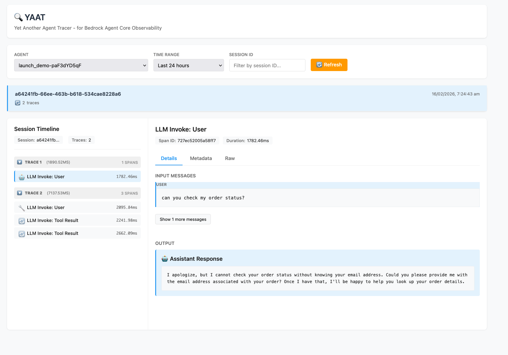
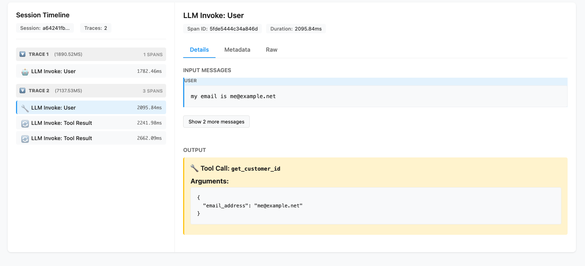
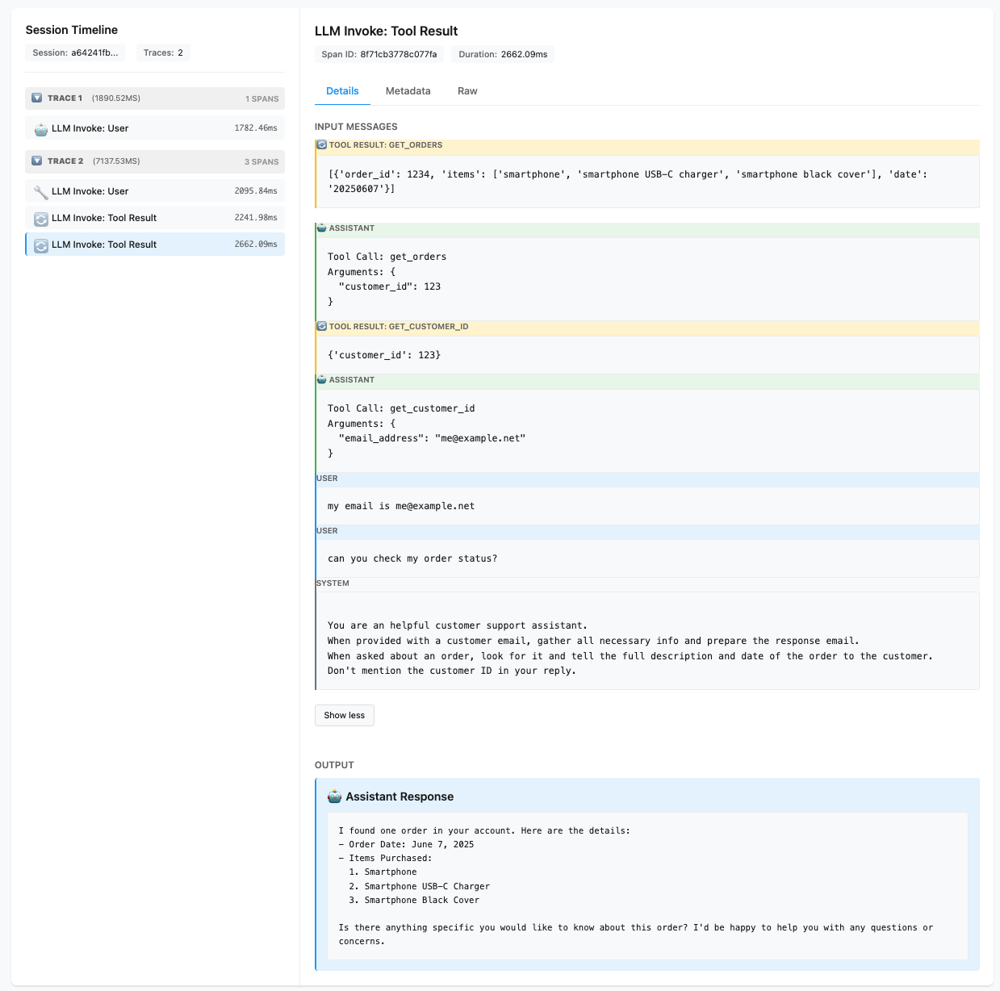

# YAAT - Yet Another Agent Tracer (For learning purposes ONLY. This is NOT prod ready and NOT meant for customer environment.)

**For Bedrock Agent Core Observability**

YAAT is a lightweight web UI for visualizing OpenTelemetry (OTEL) logs from Bedrock Agent Core agents. It reads from CloudWatch Logs and presents agent execution traces in an easy-to-understand format.

## What is Bedrock Agent Core?

Bedrock Agent Core is AWS's runtime environment for building and deploying AI agents. When you run an agent with OTEL instrumentation enabled, it automatically emits structured logs to CloudWatch.

## Understanding OTEL Logs in Agent Core

### Log Location

Agent Core automatically writes OTEL logs to:
- **Log Group**: `/aws/bedrock-agentcore/runtimes/<agent-id>-DEFAULT`
- **Log Stream**: `otel-rt-logs`

### OTEL Log Structure

Each log entry is a JSON object with this structure:

```json
{
  "resource": {
    "attributes": {
      "service.name": "launch_demo.DEFAULT",
      "cloud.region": "us-east-1",
      "aws.service.type": "gen_ai_agent"
    }
  },
  "scope": {
    "name": "opentelemetry.instrumentation.botocore.bedrock-runtime",
    "schemaUrl": "https://opentelemetry.io/schemas/1.30.0"
  },
  "timeUnixNano": 1771226681707013018,
  "observedTimeUnixNano": 1771226681707028951,
  "severityNumber": 9,
  "severityText": "",
  "body": {
    "content": [{"text": "You are a helpful assistant..."}]
  },
  "attributes": {
    "event.name": "gen_ai.user.message",
    "gen_ai.system": "aws.bedrock",
    "session.id": "a64241fb-66ee-463b-b618-534cae8228a6"
  },
  "flags": 1,
  "traceId": "6992c63913df35667a2817b27c99cfe3",
  "spanId": "727ec52005a58ff7"
}
```

### Key Fields Explained

#### Resource
- **`resource.attributes.service.name`**: Agent name and environment
- **`resource.attributes.cloud.region`**: AWS region
- **`resource.attributes.aws.service.type`**: Always `gen_ai_agent` for Agent Core

#### Scope
- **`scope.name`**: Instrumentation library that generated the log
  - `opentelemetry.instrumentation.botocore.bedrock-runtime`: LLM interactions
  - `strands.telemetry.tracer`: Agent framework events
  - `bedrock_agentcore.app`: System/runtime logs

#### Timestamps
- **`timeUnixNano`**: When the event occurred (nanoseconds since epoch)
- **`observedTimeUnixNano`**: When the log was recorded

#### Body
Contains the actual event data. Structure varies by event type:
- **User messages**: `{"content": [{"text": "..."}]}`
- **Tool calls**: `{"message": {"tool_calls": [...]}}`
- **LLM responses**: `{"message": {"content": [...], "role": "assistant"}}`

#### Attributes
- **`event.name`**: Type of event (see Event Types below)
- **`gen_ai.system`**: Always `aws.bedrock`
- **`session.id`**: Unique identifier for the conversation session (only in `strands.telemetry.tracer` logs)
- **`gen_ai.usage.input_tokens`**: Token count for input
- **`gen_ai.usage.output_tokens`**: Token count for output

#### Trace & Span IDs
- **`traceId`**: Unique identifier for one agent invocation (one turn in conversation)
- **`spanId`**: Unique identifier for one LLM call within a trace
  - Multiple events can share the same `spanId` (they're part of the same LLM invocation)

### Event Types

Agent Core emits these event types (identified by `attributes.event.name`):

1. **`gen_ai.system.message`**: System prompt sent to LLM
2. **`gen_ai.user.message`**: User input or tool result fed to LLM
3. **`gen_ai.assistant.message`**: LLM's response (may include tool calls)
4. **`gen_ai.choice`**: LLM decision point with `finish_reason`
   - `finish_reason: "end_turn"`: Final text response
   - `finish_reason: "tool_use"`: LLM wants to call a tool
5. **`gen_ai.tool.message`**: Tool execution result
6. **`strands.telemetry.tracer`**: Complete agent turn summary (contains `session.id`)

### Hierarchical Structure

```
Session (conversation)
└── Trace 1 (first invocation)
    └── Span 1 (LLM call)
        ├── gen_ai.system.message
        ├── gen_ai.user.message
        └── gen_ai.choice (finish_reason: end_turn)
└── Trace 2 (second invocation)
    └── Span 1 (LLM call with tool)
        ├── gen_ai.system.message
        ├── gen_ai.user.message
        ├── gen_ai.choice (finish_reason: tool_use)
        └── gen_ai.tool.message
    └── Span 2 (LLM call after tool)
        ├── gen_ai.system.message
        ├── gen_ai.user.message (tool result)
        └── gen_ai.choice (finish_reason: end_turn)
```

## What YAAT Does

YAAT reads these OTEL logs from CloudWatch and:

1. **Groups by Session**: Uses `session.id` from `strands.telemetry.tracer` logs
2. **Groups by Trace**: Each `traceId` represents one agent invocation
3. **Groups by Span**: Events with the same `spanId` are combined into one logical operation
4. **Deduplicates**: Removes redundant events (e.g., `gen_ai.assistant.message` is a duplicate of `gen_ai.choice`)
5. **Visualizes**: Shows the conversation flow with input messages, tool calls, and responses

### Screenshots

**Session List View**



**Trace Timeline with Spans**



**Span Details with Input/Output**



### Key Features

- **Session Timeline**: See all invocations in a conversation
- **Span Details**: View input messages (system, user, tool results) and outputs (tool calls or text responses)
- **Trigger Detection**: Shows whether each LLM invocation was triggered by user input or a tool result
- **Token Tracking**: Displays input/output token counts when available
- **Raw OTEL Access**: View the original OTEL events for debugging

## Installation & Usage

### Prerequisites
- Python 3.8+
- AWS credentials with CloudWatch Logs read access
- An Agent Core agent with OTEL instrumentation enabled

### Install uv (Recommended)

```bash
# macOS/Linux
curl -LsSf https://astral.sh/uv/install.sh | sh

# Windows
powershell -c "irm https://astral.sh/uv/install.ps1 | iex"

# Or with pip
pip install uv
```

### Run YAAT

```bash
# Using uv (recommended - no installation needed)
uv run yaat.py

# Or with Python (requires manual dependency installation)
pip install flask boto3
python yaat.py
```

The UI will open automatically at `http://localhost:5000`

### AWS Credentials

YAAT uses boto3 to access CloudWatch Logs. Provide credentials via:
- Environment variables (`AWS_ACCESS_KEY_ID`, `AWS_SECRET_ACCESS_KEY`, `AWS_REGION`)
- AWS credentials file (`~/.aws/credentials`)
- Or enter them in the UI (saved to browser localStorage)

## Example: Reading a 2-Turn Conversation

Given this conversation:
1. User: "can you check my order status?"
2. Agent: "I need your email address"
3. User: "my email is me@example.net"
4. Agent: [calls get_customer_id tool] → [calls get_orders tool] → "I found one order..."

YAAT shows:
- **Session**: `a64241fb-66ee-463b-b618-534cae8228a6`
  - **Trace 1** (1890ms): 1 span
    - 🔧 LLM Invoke: User → "I need your email address"
  - **Trace 2** (7137ms): 3 spans
    - 🔧 LLM Invoke: User → Tool Call: get_customer_id
    - 🔄 LLM Invoke: Tool Result → Tool Call: get_orders
    - 🔄 LLM Invoke: Tool Result → "I found one order..."

## Technical Details

- **Backend**: Flask + boto3
- **Frontend**: Alpine.js for reactivity
- **Data Source**: CloudWatch Logs Insights API
- **Query Window**: Last 24 hours (configurable)

## Limitations

- Currently optimized for Bedrock Agent Core's Strands framework
- Requires `session.id` in `strands.telemetry.tracer` logs for session grouping
- Other frameworks (LangGraph, etc.) may need additional attribute mapping

## Future Enhancements

- Support for LangGraph and other OTEL-instrumented frameworks
- Real-time log streaming
- Export traces to JSON/CSV
- Cost tracking (token usage × pricing)
- Multi-agent conversation visualization

## License

MIT

## Contributing

Contributions welcome! This tool is designed to help developers understand and debug their Agent Core agents through OTEL observability data.
